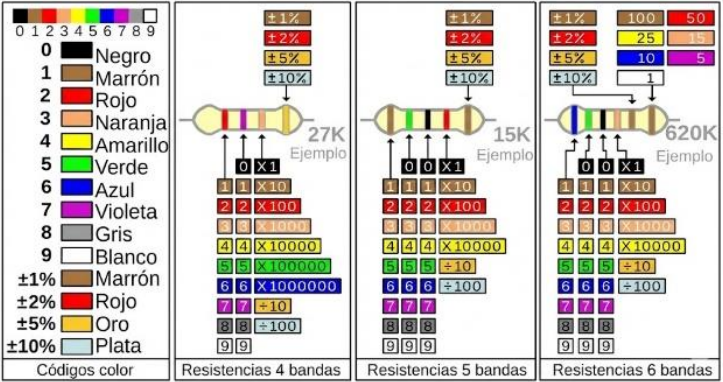

# Formulario de Física — Compilación Completa

> Compilación estructurada de fórmulas, constantes, despejes y tablas para migración a LaTeX.

---

## 1. Prefijos de Ingeniería

### Submúltiplos

| Prefijo | Símbolo | Factor |
|:--------|:--------|:-------|
| deci    | d       | $\\times 10^{-1}$  |
| centi   | c       | $\\times 10^{-2}$  |
| mili    | m       | $\\times 10^{-3}$  |
| micro   | $\\mu$  | $\\times 10^{-6}$  |
| nano    | n       | $\\times 10^{-9}$  |
| pico    | p       | $\\times 10^{-12}$ |
| femto   | f       | $\\times 10^{-15}$ |

### Múltiplos

| Prefijo | Símbolo | Factor |
|:--------|:--------|:-------|
| kilo    | k       | $\\times 10^{3}$  |
| mega    | M       | $\\times 10^{6}$  |
| giga    | G       | $\\times 10^{9}$  |

---

## 2. Matemáticas de Apoyo

### 2.1 Coordenadas y Distancia

$$\\alpha = \\tan^{-1}\\left(\\frac{y}{x}\\right)$$

$$d = \\sqrt{(y_2 - y_1)^2 + (x_2 - x_1)^2}$$

### 2.2 Teorema de Pitágoras

$$c = \\sqrt{a^2 + b^2} \\quad a = \\sqrt{c^2 - b^2} \\quad b = \\sqrt{c^2 - a^2}$$

**Triángulo isósceles rectángulo:**

$$x = \\sqrt{\\frac{c^2}{2}} \\quad c = \\sqrt{2x^2}$$

### 2.3 Teoremas del Seno y Coseno

$$a = \\sqrt{b^2 + c^2 - 2bc\\cos(\\alpha)}$$
$$b = \\sqrt{a^2 + c^2 - 2ac\\cos(\\beta)}$$
$$c = \\sqrt{a^2 + b^2 - 2ab\\cos(\\gamma)}$$

$$\\frac{\\sin(\\alpha)}{a} = \\frac{\\sin(\\beta)}{b} = \\frac{\\sin(\\gamma)}{c}$$

$$\\alpha = \\cos^{-1}\\left(\\frac{-a^2 + b^2 + c^2}{2bc}\\right)$$
$$\\beta = \\cos^{-1}\\left(\\frac{-b^2 + a^2 + c^2}{2ac}\\right)$$
$$\\gamma = \\cos^{-1}\\left(\\frac{-c^2 + a^2 + b^2}{2ab}\\right)$$

### 2.4 Áreas de Figuras Comunes

$$A = \\pi r^2 \\quad A = b \\cdot h \\quad A = l^2$$

*(Todo en metros)*

---

## 3. Partículas Subatómicas

| Partícula | Masa | Carga |
|:----------|:-----|:------|
| Electrón  | $m_e = 9.11 \\times 10^{-31} \\text{ kg}$ | $q = -1.602 \\times 10^{-19} \\text{ C}$ |
| Protón    | $m_p = 1.673 \\times 10^{-27} \\text{ kg}$ | $q = +1.602 \\times 10^{-19} \\text{ C}$ |
| Neutrón   | $m_n = 1.675 \\times 10^{-27} \\text{ kg}$ | $q = 0$ |

---

## 4. Interacciones Eléctricas I — Ley de Coulomb

$$\\vec{F} = K \\frac{q_1 \\cdot q_2}{r^2}$$

### Despejes

$$r = \\sqrt{K \\frac{q_1 \\cdot q_2}{F}}$$

$$q_1 = \\frac{F r^2}{K q_2} \\quad q_2 = \\frac{F r^2}{K q_1}$$

**Carga cuando ambas cargas son iguales:**

$$q = \\sqrt{\\frac{F \\cdot r^2}{K}}$$

### Constantes y Variables

| Símbolo | Descripción | Unidad |
|:--------|:------------|:-------|
| $F$ | Fuerza Eléctrica | Newton $[\\text{N}]$ |
| $K$ | Constante de Coulomb | $9 \\times 10^9 \\frac{\\text{Nm}^2}{\\text{C}^2}$ |
| $q_1, q_2$ | Cargas puntuales | Coulomb $[\\text{C}]$ |
| $r$ | Distancia entre cargas | metros $[\\text{m}]$ |

### Principio de Cargas

- **Cargas iguales se repelen**
- **Cargas diferentes se atraen**

---

## 5. Ley de Gravitación Universal

$$F = G \\frac{m_1 m_2}{r^2}$$

### Despejes

$$r = \\sqrt{G \\frac{m_1 m_2}{F}}$$

$$m_1 = \\frac{F r^2}{G m_2} \\quad m_2 = \\frac{F r^2}{G m_1}$$

### Constantes y Variables

| Símbolo | Descripción | Unidad |
|:--------|:------------|:-------|
| $F$ | Fuerza Gravitatoria | Newton $[\\text{N}]$ |
| $G$ | Constante gravitacional | $6.673 \\times 10^{-11} \\frac{\\text{Nm}^2}{\\text{kg}^2}$ |
| $m_1, m_2$ | Masas puntuales | Kilogramos $[\\text{kg}]$ |
| $r$ | Distancia entre masas | metros $[\\text{m}]$ |

---

## 6. Fuerza y Peso

### Segunda Ley de Newton

$$\\vec{F} = m \\cdot \\vec{a}$$

$$m = \\frac{F}{a} \\quad a = \\frac{F}{m}$$

### Peso (Fuerza Gravitatoria en la Tierra)

$$P = m \\cdot g$$

$$m = \\frac{P}{g} \\quad g = 9.81 \\text{ m/s}^2$$

---

## 7. Campos Eléctricos

### 7.1 Definición por Fuerza

$$\\vec{E} = \\frac{\\vec{F}}{q} \\quad q = \\frac{F}{E} \\quad \\vec{F} = \\vec{E} \\cdot q$$

### 7.2 Campo Eléctrico de una Carga Puntual

$$E = \\frac{K \\cdot q}{r^2}$$

$$r = \\sqrt{\\frac{K \\cdot q}{E}} \\quad q = \\frac{E \\cdot r^2}{K}$$

### 7.3 Campo Eléctrico con Dieléctrico

$$E = \\frac{K \\cdot q}{\\varepsilon \\cdot r^2}$$

### 7.4 Relación Campo-Potencial

$$E = \\frac{V}{r} \\quad V = E \\cdot r$$

### 7.5 Algunos Valores Característicos de Intensidad de Campo Eléctrico

| Situación | Intensidad $E$ |
|:----------|:---------------|
| En un tubo de luz fluorescente | $10^1 \\text{ N/C}$ |
| En la atmósfera cerca de la Tierra, con buen tiempo | $10^2 \\text{ N/C}$ |
| Cerca de una regla plástica cargada o globo frotado con pelo | $10^3 \\text{ N/C}$ |
| En el tambor cargado de una fotocopiadora | $10^5 \\text{ N/C}$ |
| Cuando ocurre una descarga eléctrica en el aire | $> 3 \\times 10^6 \\text{ N/C}$ |
| Cerca del electrón de un átomo de hidrógeno | $5 \\times 10^{11} \\text{ N/C}$ |
| En la superficie de un núcleo de uranio | $3 \\times 10^{21} \\text{ N/C}$ |

---

## 8. Potencial Eléctrico

### 8.1 Potencial en la carga que genera el campo

$$V = \\frac{K \\cdot q}{r}$$

$$r = \\frac{K \\cdot q}{V} \\quad q = \\frac{V \\cdot r}{K}$$

### 8.2 Energía Potencial Eléctrica

$$E_p = V \\cdot q \\quad V = \\frac{E_p}{q} \\quad q = \\frac{E_p}{V}$$

### 8.3 Fórmulas Derivadas

$$E = \\frac{F}{q} = \\frac{m \\cdot a}{q} = \\frac{V \\cdot q}{r \\cdot q} = \\frac{V}{r}$$

$$q = \\frac{F \\cdot r}{V} \\quad V = \\frac{F \\cdot r}{q} \\quad r = \\frac{q \\cdot V}{F}$$

$$a = \\frac{V \\cdot q}{r \\cdot m} \\quad m = \\frac{E \\cdot q}{a} \\quad a = \\frac{E \\cdot q}{m}$$

$$V_f = \\sqrt{\\frac{2 \\cdot V \\cdot q}{m} + V_0^2}$$

### 8.4 Variables

| Símbolo | Descripción | Unidad |
|:--------|:------------|:-------|
| $K$ | Constante de Coulomb | $9 \\times 10^9 \\frac{\\text{Nm}^2}{\\text{C}^2}$ |
| $q$ | Carga | Coulomb $[\\text{C}]$ |
| $r$ | Distancia | metros $[\\text{m}]$ |
| $E$ | Campo Eléctrico | N/C |
| $E_p$ | Energía Potencial Eléctrica | Joules $[\\text{J}]$ |
| $V$ | Potencial Eléctrico | Voltios $[\\text{V}]$ |
| $a$ | Aceleración | m/s$^2$ |
| $m$ | Masa | kg |

---

## 9. Trabajo y Energía

### 9.1 Trabajo y Energía Interna de un Sistema

$$W = E_p - U$$

| Símbolo | Descripción | Unidad |
|:--------|:------------|:-------|
| $W$ | Trabajo realizado | Joules $[\\text{J}]$ |
| $E_p$ | Energía Potencial | Joules $[\\text{J}]$ |
| $U$ | Energía Interna | Joules $[\\text{J}]$ |

---

## 10. Cinemática

### 10.1 MRU (Movimiento Rectilíneo Uniforme)

$$x = V \\cdot t$$

### 10.2 MRUV (Movimiento Rectilíneo Uniformemente Variado)

$$V_f = V_0 + a \\cdot t$$

$$d = V_0 \\cdot t + \\frac{1}{2} a \\cdot t^2$$

$$V_f^2 = V_0^2 + 2 \\cdot a \\cdot d$$

### 10.3 Movimiento en Dos Dimensiones

*(Despejes de componentes en $x$ e $y$)*

---

## 11. Capacitancia Eléctrica

### 11.1 Definición de Capacitancia

$$C = \\frac{q}{\\Delta V}$$

$$q = C \\cdot \\Delta V \\quad \\Delta V = \\frac{q}{C}$$

### 11.2 Capacitor de Placas Paralelas

$$C = \\frac{\\varepsilon \\cdot A}{4 \\pi \\cdot k \\cdot d}$$

$$A = \\frac{4 \\pi \\cdot k \\cdot C \\cdot d}{\\varepsilon}$$

### 11.3 Fuerza Eléctrica con Dieléctrico

$$F = \\frac{K \\cdot q_1 \\cdot q_2}{\\varepsilon \\cdot r^2}$$

$$q_1 = \\frac{F \\cdot \\varepsilon \\cdot r^2}{K \\cdot q_2} \\quad r = \\sqrt{\\frac{K \\cdot q_1 \\cdot q_2}{F \\cdot \\varepsilon}} \\quad q_2 = \\frac{F \\cdot \\varepsilon \\cdot r^2}{K \\cdot q_1}$$

### 11.4 Rigidez Eléctrica

$$V_{\\text{máx}} = RE \\cdot d$$

$$d = \\frac{V_{\\text{máx}}}{RE} \\quad RE = \\frac{V_{\\text{máx}}}{d}$$

| Símbolo | Descripción | Unidad |
|:--------|:------------|:-------|
| $d$ | Distancia entre placas | metros $[\\text{m}]$ |
| $V_{\\text{máx}}$ | Voltaje máximo soportable | Voltios $[\\text{V}]$ |
| $RE$ | Rigidez Eléctrica | V/m |

### 11.5 Energía Acumulada en un Capacitor

$$E_p = \\frac{C \\cdot (\\Delta V)^2}{2}$$

$$C = \\frac{2 \\cdot E_p}{(\\Delta V)^2} \\quad \\Delta V = \\sqrt{\\frac{2 \\cdot E_p}{C}}$$

### 11.6 Potencia

$$P = \\frac{E_p}{t} \\quad E_p = P \\cdot t \\quad t = \\frac{E_p}{P}$$

| Símbolo | Descripción | Unidad |
|:--------|:------------|:-------|
| $E_p$ | Energía Acumulada | Joules $[\\text{J}]$ |
| $P$ | Potencia | Vatios $[\\text{W}]$ |
| $t$ | Tiempo | segundos $[\\text{s}]$ |

### 11.7 Constantes Dieléctricas y Rigidez Eléctrica

| Material | $\\varepsilon$ (cte. dieléctrica) | $RE$ (V/m) |
|:---------|:-----------------------------|:-----------|
| Aire seco | 1.00054 | $3 \\times 10^6$ |
| Madera seca | 1.5 ~ 4 | n/a |
| Teflón | 2.1 | $60 \\times 10^6$ |
| Caucho | 2.1 ~ 2.9 | $(16 \\sim 28) \\times 10^6$ |
| Aceite | 2.24 | $12 \\times 10^6$ |
| Parafina | 2.1 ~ 2.5 | $10 \\times 10^6$ |
| Polietileno | 2.26 | $(19 \\sim 22) \\times 10^6$ |
| Poliestireno | 2.6 | $24 \\times 10^6$ |
| Ebonita | 2.8 | $28 \\times 10^6$ |
| Tierra seca | n/a | — |
| Nieve | 3.3 | — |
| Plexiglas | 3.4 | $40 \\times 10^6$ |
| Papel | 3.5 ~ 3.7 | $16 \\times 10^6$ |
| Cuarzo | 3.8 | $(25 \\sim 40) \\times 10^6$ |
| Hielo | 4.2 | $0.15 \\times 10^6$ |
| Pyrex | 4.7 ~ 5.6 | $14 \\times 10^6$ |
| Baquelita | 4.9 | $24 \\times 10^6$ |
| Mica | 5.4 | $(10 \\sim 100) \\times 10^6$ |
| Vidrio | 5.4 ~ 10 | $118 \\times 10^6$ |
| Porcelana | 5.7 ~ 6.8 | $10 \\times 10^6$ |
| Neopreno | 6.9 | $12 \\times 10^6$ |
| Etanol | 25 | n/a |
| Agua (20°C) | 80.4 | n/a |

### 11.8 Asociación de Capacitores

#### En Paralelo

$$C_{\\text{total}} = C_1 + C_2 + \\cdots + C_n$$

$$Q = q_1 + q_2 + \\cdots + q_n$$

$$\\Delta V = \\Delta V_1 = \\Delta V_2 = \\cdots = \\Delta V_n$$

$$q_1 = C_1 \\cdot \\Delta V \\quad q_2 = C_2 \\cdot \\Delta V \\quad q_n = C_n \\cdot \\Delta V$$

#### En Serie

$$\\frac{1}{C_{\\text{total}}} = \\frac{1}{C_1} + \\frac{1}{C_2} + \\frac{1}{C_3} + \\cdots + \\frac{1}{C_n}$$

$$Q = q_1 = q_2 = \\cdots = q_n$$

$$\\Delta V = \\Delta V_1 + \\Delta V_2 + \\cdots + \\Delta V_n$$

$$\\Delta V_n = \\frac{q_n}{C_n}$$

---

## 12. Corriente Eléctrica I

### 12.1 Intensidad de Corriente

$$I = \\frac{\\Delta Q}{\\Delta t} \\quad \\Delta t = \\frac{\\Delta Q}{I} \\quad \\Delta Q = I \\cdot \\Delta t$$

### 12.2 Cargas y Electrones

$$N_e = \\frac{\\Delta Q}{e}$$

Donde $e = 1.602 \\times 10^{-19} \\text{ C}$

### 12.3 Energía Eléctrica

$$E = P \\cdot t \\quad P = \\frac{E}{t} \\quad t = \\frac{E}{P}$$

### 12.4 Resistividad

$$R = \\rho \\frac{L}{S} \\quad \\rho = \\frac{R \\cdot S}{L} \\quad L = \\frac{R \\cdot S}{\\rho} \\quad S = \\rho \\frac{L}{R}$$

**Área transversal de conductor circular:**

$$S = \\frac{\\pi \\cdot d^2}{4} = \\pi \\cdot r^2$$

$$r = \\sqrt{\\frac{S}{\\pi}} \\quad d = 2 \\sqrt{\\frac{S}{\\pi}}$$

| Símbolo | Descripción | Unidad |
|:--------|:------------|:-------|
| $R$ | Resistencia | Ohm $[\\Omega]$ |
| $\\rho$ | Resistividad Eléctrica | $\\Omega \\cdot \\text{m}$ |
| $L$ | Longitud del conductor | metros $[\\text{m}]$ |
| $S$ | Área transversal | m$^2$ |

#### Tabla de Resistividad de Materiales (a 23 °C)

| Material | Resistividad ($\Omega \cdot \text{m}$) |
|:---------|:----------------------------------------|
| Plata | $1,59 \times 10^{-8}$ |
| Cobre | $1,68 \times 10^{-8}$ |
| Oro | $2,20 \times 10^{-8}$ |
| Aluminio | $2,65 \times 10^{-8}$ |
| Tungsteno | $5,6 \times 10^{-8}$ |
| Hierro | $9,71 \times 10^{-8}$ |
| Acero | $7,2 \times 10^{-7}$ |
| Platino | $1,1 \times 10^{-7}$ |
| Plomo | $2,2 \times 10^{-7}$ |
| Nicromio | $1,50 \times 10^{-6}$ |
| Carbón | $3,5 \times 10^{-5}$ |
| Germanio | $4,6 \times 10^{-1}$ |
| Silicio | $6,40 \times 10^{2}$ |
| Piel humana | $5,0 \times 10^{3}$ (aprox.) |
| Vidrio | $10^{10}$ a $10^{14}$ |
| Hule | $10^{13}$ (aprox.) |
| Sulfuro | $10^{15}$ |
| Cuarzo (fundido) | $7,5 \times 10^{17}$ |

### 12.5 Ley de Ohm y Potencia — Rueda de la Ley de Ohm

| Potencia $P$ [W] | Intensidad $I$ [A] | Diferencia de Potencial $V$ [V] | Resistencia $R$ [$\\Omega$] |
|:-----------------|:-------------------|:-------------------------------|:-----------------------------|
| $P = \\frac{V^2}{R}$ | $I = \\frac{V}{R}$ | $V = \\sqrt{P \\cdot R}$ | $R = \\frac{P}{I^2}$ |
| $P = I^2 \\cdot R$ | $I = \\sqrt{\\frac{P}{R}}$ | $V = \\frac{P}{I}$ | $R = \\frac{V^2}{P}$ |
| $P = V \\cdot I$ | $I = \\frac{P}{V}$ | $V = I \\cdot R$ | $R = \\frac{V}{I}$ |

### 12.6 Conexión de Resistencias

#### En Serie

$$V_{\\text{total}} = V_1 + V_2 + \\cdots + V_n$$
$$R_{\\text{total}} = R_1 + R_2 + \\cdots + R_n$$
$$I_{\\text{total}} = I_1 = I_2 = \\cdots = I_n$$

#### En Paralelo

$$V_{\\text{total}} = V_1 = V_2 = \\cdots = V_n$$
$$\\frac{1}{R_{\\text{total}}} = \\frac{1}{R_1} + \\frac{1}{R_2} + \\cdots + \\frac{1}{R_n}$$
$$I_{\\text{total}} = I_1 + I_2 + \\cdots + I_n$$

---

### 12.7 Valores Característicos de Voltaje

| Hecho o dispositivo de interés | Voltaje (V) |
|:-------------------------------|:------------|
| Valor medio en un electrocardiograma | 5 mV |
| Pila común de linterna | 1,5 V |
| Batería de auto | 12 V |
| Valor a partir del cual es peligroso (piel húmeda: 36 V; piel seca: 12 V) | — |
| Red eléctrica de las viviendas | 110 V / 220 V |
| Producido por el pez anguila eléctrica | 600 V |
| Generador de una central eléctrica habitual | 26 kV |
| Para que se produzca una descarga eléctrica en el aire | 30 kV/cm |
| Valor común que acelera los electrones en un tubo de pantalla | 30 kV |
| En líneas de transmisión en una red de energía eléctrica | 138 kV – 765 kV |
| Que dan lugar a descargas eléctricas atmosféricas | hasta 1 000 000 kV |

### 12.8 Valores Característicos de Intensidad de Corriente

| Hecho o dispositivo de interés | Intensidad (A) |
|:-------------------------------|:---------------|
| Valores más bajos que pueden ser detectados | $1 \times 10^{-17}$ A (aprox.) |
| Impulso nervioso | $10 \mu$A |
| Base de un transistor común | 10 – 100 $\mu$A |
| LED habitual | 20 – 30 mA |
| Valor que al pasar por el cuerpo humano puede resultar letal | 0,1 A |
| Bombillo de filamento de 60 W | 0,5 A |
| Bombillo de linterna de 6 V | 0,8 A |
| Motor común para elevar agua en una casa | 5 A |
| Hornilla eléctrica | 5 – 9 A |
| Límite permisible en un fusible común de vivienda | 30 A |
| Descarga eléctrica atmosférica | 20 kA |

### 12.9 Potencia de Equipos e Instalaciones Eléctricas

| Dispositivo o instalación eléctrica | Potencia aproximada |
|:------------------------------------|:--------------------|
| Auricular | 5 mW |
| LED común | 30 mW |
| Bombillo de linterna | 5 W |
| Lámpara "ahorradora" | 20 W |
| Tubos fluorescentes | 20 W – 40 W |
| Lámparas de filamento comunes | 25 W – 100 W |
| Abanico común | 60 W |
| Televisor | 50 W – 150 W |
| Refrigerador | 180 W |
| Lavadora simple | 360 W |
| Plancha eléctrica | 300 W – 1000 W |
| Hornilla eléctrica | 600 W – 1000 W |
| Acondicionador de aire | 1,5 kW |
| Primeras centrales eléctricas (1882) | 12 kW |
| Mayores centrales termoeléctricas | 1300 MW |

## 13. Circuitos Cerrados en DC — Leyes de Kirchhoff

### 13.1 Unidades y Equivalencias

| Magnitud | S.I. | Equivalencias |
|:---------|:-----|:--------------|
| Resistencia | Ohmio ($\\Omega$) | $\\Omega = \\frac{V}{A} = \\frac{W}{A^2} = \\frac{V^2}{W} = \\frac{\\text{kg} \\cdot \\text{m}^2}{\\text{s} \\cdot \\text{C}^2} = \\frac{J}{\\text{s} \\cdot A^2} = \\frac{\\text{kg} \\cdot \\text{m}^2}{\\text{s}^3 \\cdot A^2}$ |
| Diferencia de Potencial (Voltaje, Tensión), Fuerza electromotriz | Voltio (V) | $V = \\frac{W}{A} = \\frac{J}{A \\cdot s} = \\frac{J}{C} = \\frac{N \\cdot m}{A \\cdot s} = \\frac{\\text{kg} \\cdot \\text{m}^2}{A \\cdot \\text{s}^3}$ |
| Intensidad de Corriente (I) | Amperio (A) | $A = \\frac{C}{s}$ |

### 13.2 Primera Ley de Kirchhoff (Ley de Nodos)

$$\\sum I_{\\text{entrantes}} - \\sum I_{\\text{salientes}} = 0$$

- Las corrientes **entrantes** van sumando $(+)$
- Las corrientes **salientes** van restando $(-)$

### 13.3 Segunda Ley de Kirchhoff (Ley de Mallas)

$$\\sum I \\cdot R = \\sum V$$

### 13.4 Criterio de Signos

- La flecha **roja** indica la dirección de la malla.
- La flecha **azul** indica la dirección de la corriente de la malla $(I_1, I_2, \\dots)$
- Fuentes: $+V_{\\text{em}}$ si se recorre de $-$ a $+$, $-V_{\\text{em}}$ si se recorre de $+$ a $-$.
- Resistencias: caída de potencial $-I \\cdot R$ si la corriente va en el sentido de la malla.

---

## 14. Introducción al Electromagnetismo

### 14.1 Campo Magnético y Cargas en Movimiento (Fuerza de Lorentz Magnética)

$$\\vec{F} = q \\left( \\vec{v} \\times \\vec{B} \\right)$$

$$|\\vec{F}| = q \\cdot v \\cdot B \\cdot \\sin(\\theta)$$

### Despejes

$$q = \\frac{|F|}{v \\cdot B \\cdot \\sin(\\theta)}$$

$$v = \\frac{|F|}{q \\cdot B \\cdot \\sin(\\theta)}$$

### 14.2 Fuerza de Lorentz Total (Campo Eléctrico + Magnético)

$$\\vec{F} = q \\left( \\vec{E} + \\vec{v} \\times \\vec{B} \\right)$$

### 14.3 Movimiento Circular en Campo Magnético

$$r = \\frac{m \\cdot v}{q \\cdot B \\cdot \\sin(\\theta)}$$

$$v = \\frac{q \\cdot B \\cdot r \\cdot \\sin(\\theta)}{m}$$

$$m = \\frac{q \\cdot B \\cdot r \\cdot \\sin(\\theta)}{v}$$

### 14.4 Período de Movimiento Circular

$$T = \\frac{2\\pi \\cdot m}{q \\cdot B \\cdot \\sin(\\theta)}$$

$$B = \\frac{2\\pi \\cdot m}{T \\cdot q \\cdot \\sin(\\theta)}$$

$$m = \\frac{T \\cdot q \\cdot B \\cdot \\sin(\\theta)}{2\\pi}$$

### 14.5 Variables

| Símbolo | Descripción | Unidad |
|:--------|:------------|:-------|
| $F$ | Fuerza de Lorentz | Newton $[\\text{N}]$ |
| $q$ | Carga eléctrica | Coulomb $[\\text{C}]$ |
| $v$ | Velocidad | m/s |
| $B$ | Campo Magnético | Tesla $[\\text{T}]$ |
| $\\theta$ | Ángulo entre $\\vec{v}$ y $\\vec{B}$ | grados/radianes |
| $E$ | Campo Eléctrico | N/C o V/m |
| $r$ | Radio de la órbita | metros $[\\text{m}]$ |
| $m$ | Masa del móvil | kg |
| $T$ | Período | segundos $[\\text{s}]$ |

### 14.6 Equivalencia de Unidades Magnéticas

$$1 \\text{ T} = 1 \\frac{\\text{N}}{\\text{C} \\cdot \\text{m/s}} = 1 \\frac{\\text{N}}{\\text{A} \\cdot \\text{m}}$$

$$1 \\text{ Tesla} = 10{,}000 \\text{ Gauss}$$

### 14.7 Convención de Vectores

- $\\odot$ : Vector que **sale** del plano (hacia ti)
- $\\otimes$ : Vector que **entra** al plano (alejándose de ti)

### 14.8 Regla de la Mano Derecha

- Pulgar: dirección de $\\vec{F}$
- Índice: dirección de $\\vec{B}$
- Medio: dirección de $\\vec{v}$

*(Válido para carga positiva; invertir para carga negativa)*

---

## 15. Orden de los Vectores Unitarios

$$+\\hat{\\imath} \\quad -\\hat{\\imath} \\quad +\\hat{\\jmath} \\quad -\\hat{\\jmath}$$

---

## 16. Código de Colores de Resistencias 

### Tabla de Colores

| Color | Dígito | Multiplicador | Tolerancia |
|:------|:-------|:--------------|:-----------|
| Negro | 0 | $\times 1$ | — |
| Marrón | 1 | $\times 10$ | $\pm 1\%$ |
| Rojo | 2 | $\times 100$ | $\pm 2\%$ |
| Naranja | 3 | $\times 1{,}000$ | — |
| Amarillo | 4 | $\times 10{,}000$ | — |
| Verde | 5 | $\times 100{,}000$ | $\pm 0{,}5\%$ |
| Azul | 6 | $\times 1{,}000{,}000$ | $\pm 0{,}25\%$ |
| Violeta | 7 | $\times 10{,}000{,}000$ | $\pm 0{,}1\%$ |
| Gris | 8 | $\times 100{,}000{,}000$ | $\pm 0{,}05\%$ |
| Blanco | 9 | $\times 1{,}000{,}000{,}000$ | — |
| Dorado | — | $\times 0{,}1$ | $\pm 5\%$ |
| Plateado | — | $\times 0{,}01$ | $\pm 10\%$ |

### Ejemplos

- **4 bandas:** 2 (rojo) – 7 (violeta) – $\times 10^3$ (naranja) $\rightarrow$ 27 k$\Omega$
- **5 bandas:** 1 (marrón) – 5 (verde) – 0 (negro) – $\times 10^3$ (naranja) $\rightarrow$ 150 k$\Omega$
- **6 bandas:** 6 (azul) – 2 (rojo) – 0 (negro) – $\times 10^2$ (rojo) $\rightarrow$ 62 k$\Omega$

## Apéndice: Constantes Fundamentales

| Constante | Valor | Unidad |
|:----------|:------|:-------|
| $K$ (Coulomb) | $9 \\times 10^9$ | $\\frac{\\text{Nm}^2}{\\text{C}^2}$ |
| $G$ (Gravitación) | $6.673 \\times 10^{-11}$ | $\\frac{\\text{Nm}^2}{\\text{kg}^2}$ |
| $g$ (gravedad Tierra) | $9.81$ | $\\text{m/s}^2$ |
| $e$ (carga elemental) | $1.602 \\times 10^{-19}$ | C |
| $\\pi$ | $\\approx 3.1416$ | — |
| $k$ (constante dieléctrica vacío) | $9 \\times 10^9$ | $\\frac{\\text{Nm}^2}{\\text{C}^2}$ |

---

*Fin del formulario compilado.*
